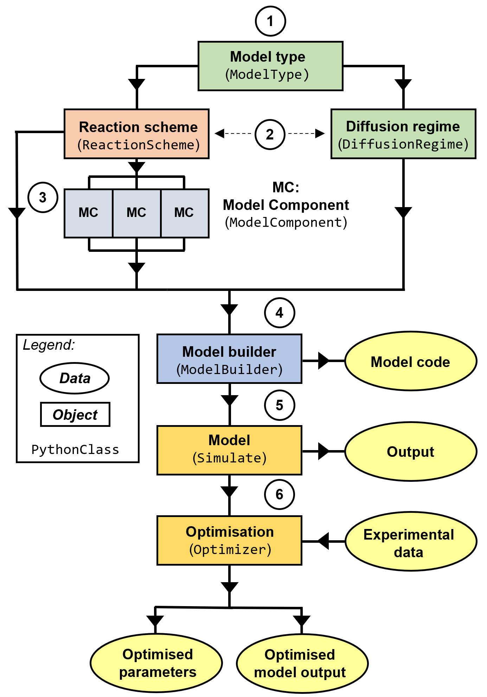

# MutilayerPy
 A package used to build a kinetic multi-layer model for aerosol particles and films. Released under the GNU GPL v3.0 license.

### Contents
- [Overview](#overview)
- [Installation](#installation)
- [Contributing](#contributing)
- [Reference documentation](#reference-documentation)
- [Acknowledgement and citation](#acknowledgement-and-citation)

## Overview
MultilayerPy is a Python-based framework for constructing, running and optimising kinetic multi-layer models of aerosol particles and films.
In this repository you will find the core MultilayerPy package along with reference documentation (an html file) and a directory of tutorial Jupyter notebooks to get you started. 

The framework is summarised in the figure below:

MultilayerPy takes advantage of the object-oriented programming (OOP) paradigm and represents the common building blocks (reaction scheme, diffusion regime, model components) as separate classes.

These classes can be used to build the model, the code for which is automatically generated by MultilayerPy. 

The model can be paired with experimental data in order to carry out inverse modelling: where model parameters are adjusted such that the best fit to the data is obtained.This can be done using a local or global optimisation algorithm.

Additionally, Markov Chain Monte Carlo (MCMC) sampling of the model-data system can be carried out using MultilayerPy, incorporating the well-established emcee Python package. 

A more detailed description of how MultilayerPy works is outlined in the reference manual and in the upcoming manuscript (close to submission). 

## Installation
The easiest way to install MultilayerPy on your system is to download this repository as a .zip file from the releases tab in this repository. 
However, the easiest way to keep an up-to-date version on your system is to clone the repository using git and the command line:

`$ git clone https://github.com/tintin554/kinetic-multilayer-model-builder.git`

Then a simple `$ git pull` would update your local copy with the latest "nightly" version of the package. 
Be warned that these may not be the final stable versions of the next release of MultilayerPy. Check this by typing `print(multilayerpy.__version__)` into your python terminal.
Download the package from the releases tab for the latest stable version. 

If you want to make changes to the source code and/or submit pull requests, fork this repository and include your own features. This is highly encouraged! (see 'Contributing')

Unit tests should be run after installing or updating the package. Run the testing.py script from the terminal: `$ python -m unittest testing.py -v`. There should be no failures. 

### Dependencies
This package requires the standard Anaconda python distribution (developed on Python version `3.8.8`) and the following packages (and versions) are used for development:
- SciPy (1.7.3)
- NumPy (1.20.1)
- Matplotlib (3.3.4)
- emcee (3.1.1)

Scipy, Numpy and Matplotlib come with the standard Anaconda python distribution. The most straightforward way to install emcee on your system is to type `pip install emcee` into your python terminal.
MultilayerPy works on emcee version 3.1.1 onwards (this is monitored). 

## Reference documentation
Open the reference documentation html file in your internet browser. There is a search function which enables the user to search the package for documenation on a specific aspect of the source code. 

## Contributing
In order for this project to progress, input from the community is vital. Please use the issues section of this repository to flag any issues. Forking this repository and submitting pull requests for discussion is highly encouraged as this is the best way to develop and improve this package. 

Please send general feedback and suggestions to the package creator using these details:

Adam Milsom (University of Birmingham): a.milsom.2@bham.ac.uk

Suggestions are very welcome!

## Acknowledgement and citation
We would greatly appreciate citation of the description paper (in submission) and source code (Zenodo repository LINK) if MultilayerPy was used in your study. 